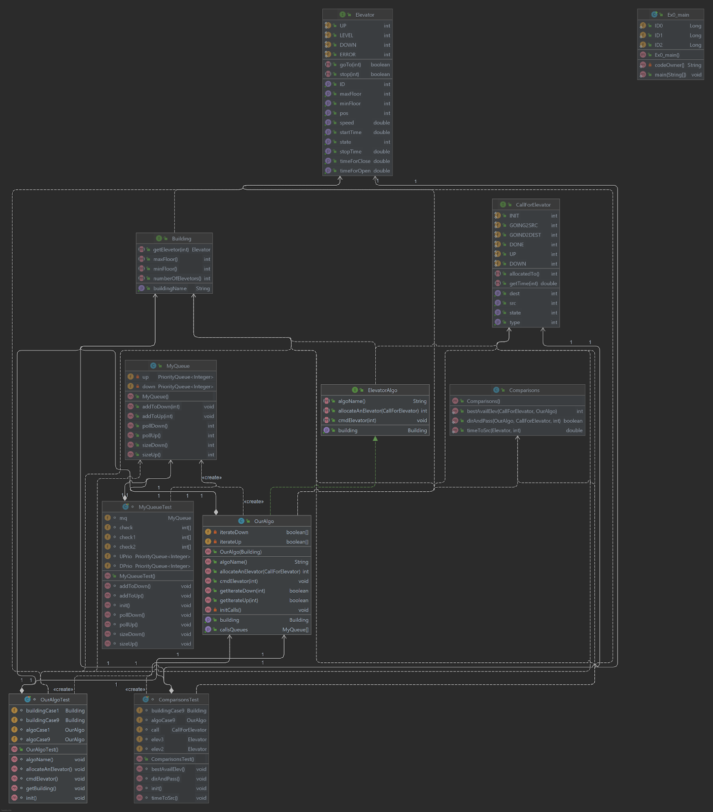

# Online elevators allocation system
> made by Elad Seznayev and Nerya Bigon.
* As part of OOP course assignment.

Our goal in this repository is to creat an online elevator allocation algorithm, that works as efficiently as possible.
we define efficiency as reducing the time passed from the moment a call was received until the elevator reached the destination.

## Approach:
An online elevators allocation algorithm is an algorithm, design to allocate elevators to passengers when all the input is given in real time.  
The fact that the input given in real time, limits the amount of time the potential algorithm have to calculate an optimal allocation.
In this repository we will attempt to suggest an appoach for an efficient online algorithm. 

For more information on this topic we recommend reading the following articles:
* This one dive deep into the subject, it helped us specipicly on it's unique approach to offline algorithm (page 70) - https://1drv.ms/b/s!AuDWVVpV6-rC7na9FC_0fi-pJ1Ig?e=vevmW4  
* This one gave us (on page 146) a point to think about with regard to online algorithm - tha algorithm has to work within a certain time limit -  https://repository.lboro.ac.uk/articles/thesis/An_intelligent_real-time_lift_scheduling_system/9539087/files/17168627.pdf  

* In this one we were introduced to the idea of dynamic partition of elevator allocation system - http://citeseerx.ist.psu.edu/viewdoc/download?doi=10.1.1.476.8791&rep=rep1&type=pdf  

## Online Algorithm:
First of all we'll describe the data structure we used to store the calls.  
We are using an array in the size of the amount of elevators, such that each cell represent by two priority queues of calls, one for ascending calls and the other for descending calls.  

Every time the system recieves a call, the algorithm assigning the source and destanition of the call to the correct direction queue of the elevator it decide is the optimal elevator for the job.  
because we used priority queues, the floors order is always kept sorted, and as long as the elevator doesn't pass a certain floor it is posible to insert more calls from this floor and beyond in the direction of travel.  
An elevator will not change direction while there are still calls in the current direction queue.

#### In short: 
we'll use a couple of functions in order to decide which elevator is the optimal one for the current call.  

1. Time to src - calculate the time it'll take the elevator to get to the call's source floor.
2. direction and did alrady passed - check the elevator direction and if it alrady passed the call's source floor.
3. best elevator - going through all of the elevators and using the two functions above in order to decide which elevator is the best one.  

## UML:
  

## How To Run:

